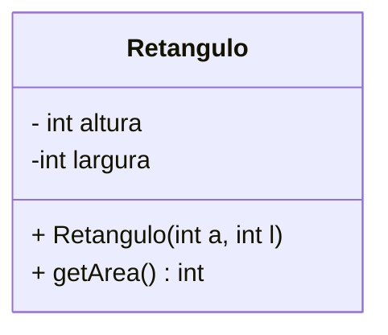
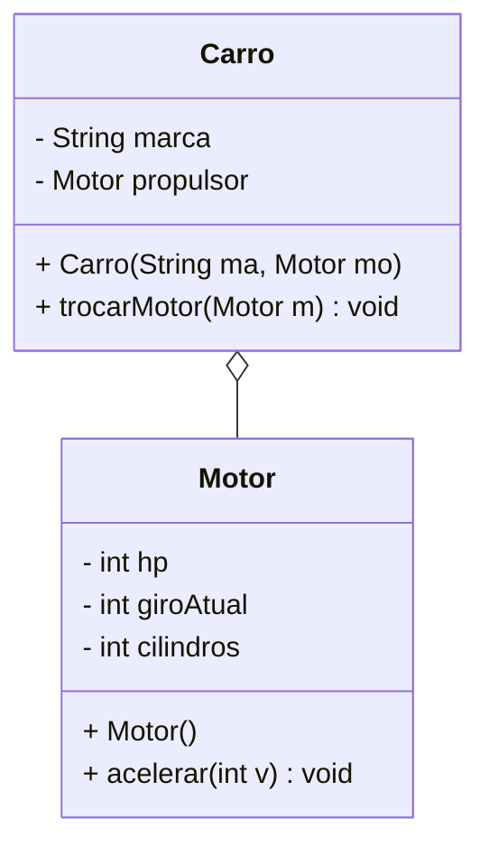

# Diagrama de classes UML

```mermaid
classDiagram
    class Retangulo{
        - int altura
        -int largura
        + Retangulo(int a, int l)
        + getArea() int
    }
```

```mermaid
classDiagram
    Carro o-- Motor
    
    class Carro{
        - String marca
        - Motor propulsor
        + Carro(String ma, Motor mo)
        + trocarMotor(Motor m) void
    }
     
    class Motor{
        - int hp
        - int giroAtual
        - int cilindros
        + Motor()
        + acelerar (int v) void
    }
```
