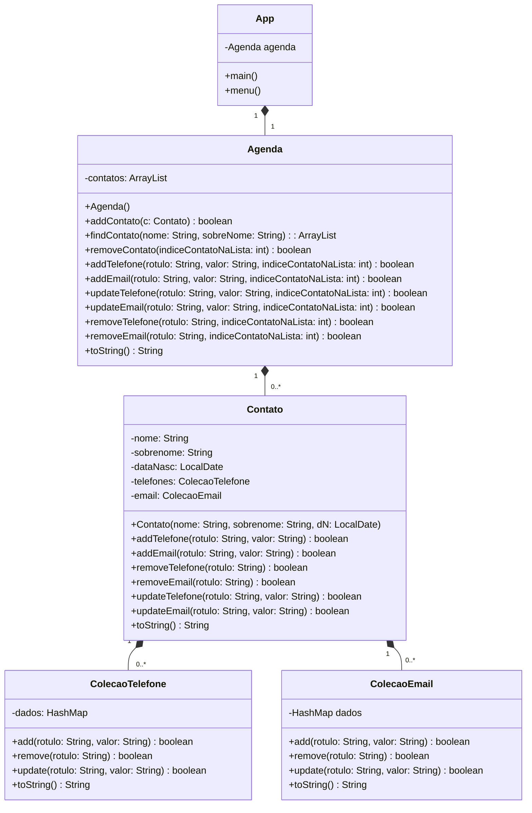

# Diagrama de classes - Sistema Para Gestão de Agenda Telefônica

```mermaid
    classDiagram
        class App{
            -Agenda agenda
            +main()
            +menu()
        }
        class Agenda{
            -contatos: ArrayList<Contato>
            +Agenda()
            +addContato(c: Contato) boolean
            +findContato(nome: String, sobreNome: String): ArrayList<Contato>
            +removeContato(indiceContatoNaLista: int) boolean
            +addTelefone(rotulo: String, valor: String, indiceContatoNaLista: int) boolean
            +addEmail(rotulo: String, valor: String, indiceContatoNaLista: int) boolean
            +updateTelefone(rotulo: String, valor: String, indiceContatoNaLista: int) boolean
            +updateEmail(rotulo: String, valor: String, indiceContatoNaLista: int) boolean
            +removeTelefone(rotulo: String, indiceContatoNaLista: int) boolean
            +removeEmail(rotulo: String, indiceContatoNaLista: int) boolean
            +toString() String
        }
        class Contato{
            -nome: String
            -sobrenome: String
            -dataNasc: LocalDate
            -telefones: ColecaoTelefone
            -email: ColecaoEmail
            +Contato(nome: String, sobrenome: String, dN: LocalDate)
            +addTelefone(rotulo: String, valor: String) boolean
            +addEmail(rotulo: String, valor: String) boolean
            +removeTelefone(rotulo: String) boolean
            +removeEmail(rotulo: String) boolean
            +updateTelefone(rotulo: String, valor: String) boolean
            +updateEmail(rotulo: String, valor: String) boolean
            +toString() String
        }
        class ColecaoTelefone{
            -dados: HashMap<String><String>
            +add(rotulo: String, valor: String) boolean
            +remove(rotulo: String) boolean
            +update(rotulo: String, valor: String) boolean
            +toString() String
        }
        class ColecaoEmail{
            -HashMap<String><String> dados
            +add(rotulo: String, valor: String) boolean
            +remove(rotulo: String) boolean
            +update(rotulo: String, valor: String) boolean
            +toString() String
        }
        
        App "1" *-- "1" Agenda
        Agenda "1" *-- "0..*" Contato
        Contato "1" *-- "0..*" ColecaoTelefone
        Contato "1" *-- "0..*" ColecaoEmail
```