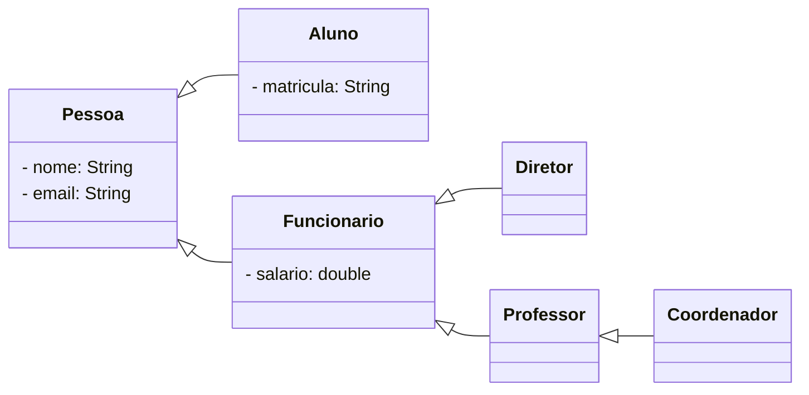
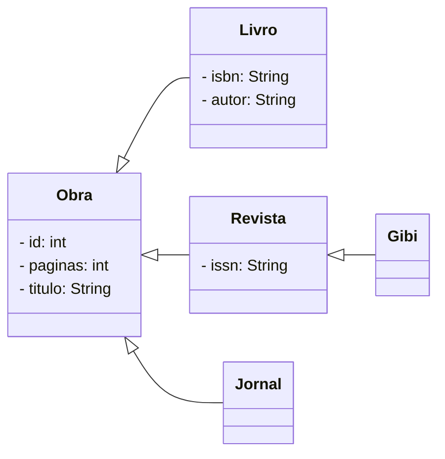

# Exercicios UML com associações de herança

```mermaid
classDiagram
    direction LR
    
    Pessoa <|-- Aluno
    Pessoa <|-- Funcionario
    Funcionario <|-- Diretor
    Funcionario <|-- Professor
    Professor <|-- Coordenador
    
    class Pessoa {
        - nome: String
        - email: String
    }
    
    class Funcionario {
        - salario: double
    }
    
    class Diretor{
        
    }
    
    class Professor{
        
    }
    
    class Coordenador{
        
    }
    
    class Aluno{
        - matricula: String
    }

```

```mermaid
classDiagram
    direction LR
    
    Obra <|-- Livro
    Obra <|-- Revista
    Obra <|-- Jornal
    Revista <|-- Gibi
    
    class Obra{
        - id: int
        - paginas: int
        - titulo: String
    }
    
    class Livro{
        - isbn: String
        - autor: String
    }
    
    class Revista{
        - issn: String
        
    }
    
    class Gibi{
        
    }
    
    class Jornal{
        
    }
```