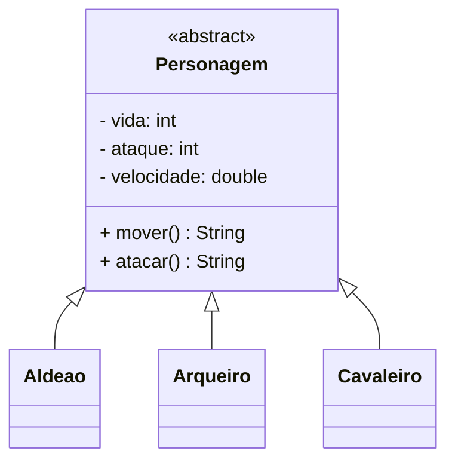

# Diagrama de Classe UML - Java of Empires

```mermaid
classDiagram
    class Personagem{
        <<abstract>>
        - vida: int
        - ataque: int
        - velocidade: double
        + mover() String
        + atacar() String
    }
    
    class Aldeao{
        
    }
    
    class Arqueiro{
        
    }
    
    class Cavaleiro{
        
    }
    
    Personagem <|-- Aldeao
    Personagem <|-- Arqueiro
    Personagem <|-- Cavaleiro

```